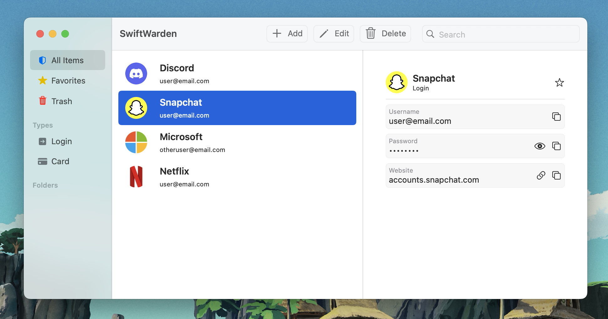

<h2 align="center">Swiftwarden</h2>

    An elegant MacOS client for Bitwarden written in Swift

# Supports
- Basic password creation, viewing and interacting
- Logging in through official or selfhosted servers
- TouchID login

# Implemented
- [X] Decryption of organization passwords
- [X] Allow for both selfhosted and official bitwarden instances to work (currently only selfhosted)
- [X] Cache images
- [X] Make UI Prettier
- [X] Fingerprint authentication

# Todo
- [ ] Properly implement other Bitwarden features 
    - [X] (identity, card, securenote) 
    - [ ] Other encryption methods
- [ ] Create settings page
- [ ] Save user data/allow multiple logins
